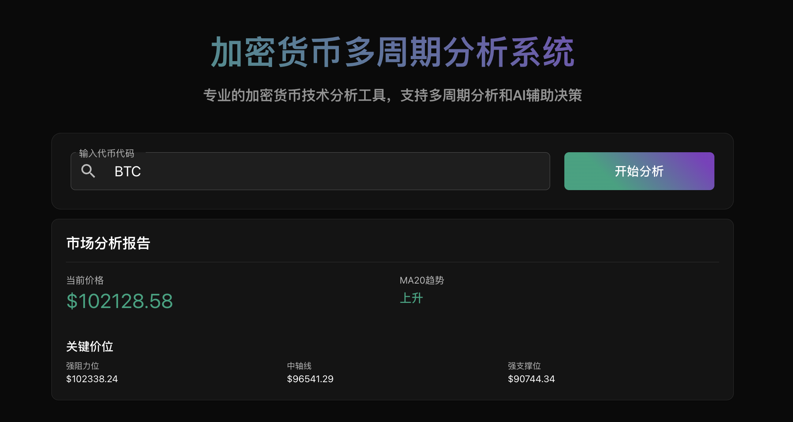
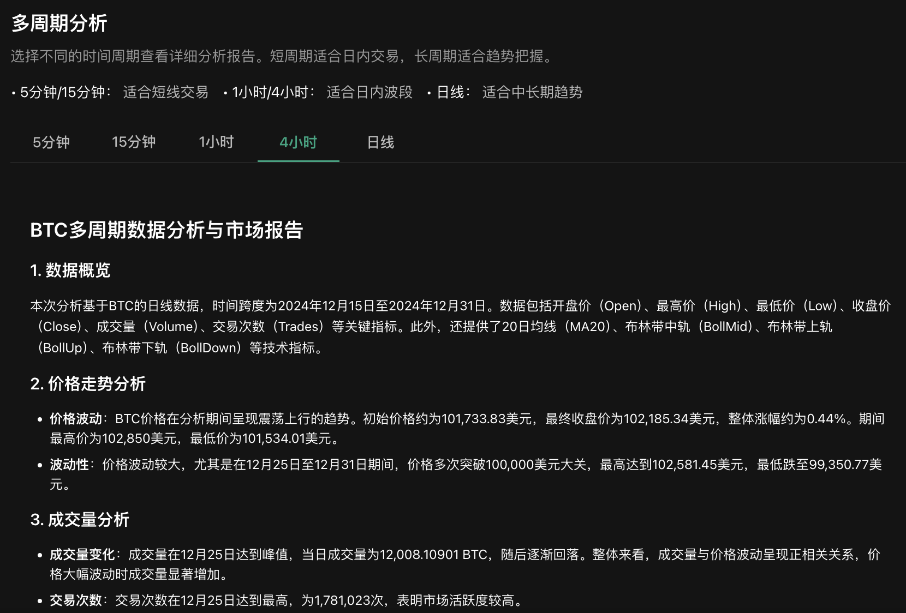
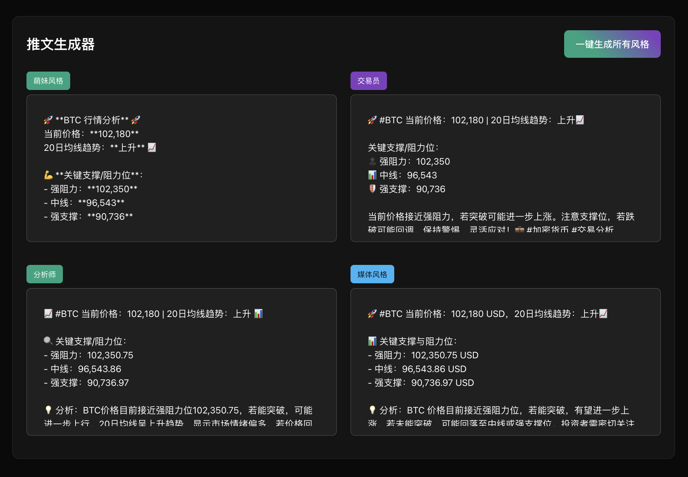

# 加密货币多周期分析系统 / Cryptocurrency Multi-Period Analysis System

一个基于 React 和 AI 的加密货币分析工具，提供多周期技术分析和智能交易建议。
在 https://solanago.top 上部署

A React-based cryptocurrency analysis tool powered by AI, offering multi-period technical analysis and intelligent trading suggestions.
now running on https://solanago.top
## 功能特点 / Features

- 🚀 多周期分析 / Multi-period Analysis
  - 支持5分钟到日线等多个时间周期
  - Supports multiple timeframes from 5-minute to daily charts
  
- 🤖 AI 驱动分析 / AI-Powered Analysis
  - 智能生成市场分析报告
  - AI-generated market analysis reports
  
- 💡 智能推文生成 / Smart Tweet Generator
  - 支持多种风格的市场评论
  - Market comments in multiple styles
  
- 📊 技术指标分析 / Technical Indicator Analysis
  - 均线、布林带等技术指标
  - Moving averages, Bollinger Bands, and other technical indicators

## 技术栈 / Tech Stack

- React + TypeScript
- Material-UI (MUI)
- OpenAI API
- Binance API

## 安装步骤 / Installation

1. 克隆仓库 / Clone the repository
2. 安装依赖 / Install dependencies
3. 配置环境变量 / Configure environment variables
编辑 .env 文件，填入你的 API 密钥 / Edit .env file with your API keys
4. 启动项目 / Start the project

## 使用说明 / Usage

1. 输入加密货币代码（如：BTC、ETH）
2. 选择时间周期
3. 查看详细分析报告
4. 使用推文生成器获取市场评论

1. Enter cryptocurrency code (e.g., BTC, ETH)
2. Select time period
3. View detailed analysis report
4. Use tweet generator for market comments

## 项目截图 / Screenshots

### 主页面分析 / Main Analysis Page

### 多周期分析 / Multi-Period Analysis

### 智能推文生成 / Smart Tweet Generator

## 贡献指南 / Contributing

欢迎提交 Pull Requests 和 Issues。

Pull Requests and Issues are welcome.

## 免责声明 / Disclaimer

本项目仅供学习和参考，不构成投资建议。加密货币市场风险较大，请谨慎决策。

This project is for learning and reference only and does not constitute investment advice. Cryptocurrency markets carry high risk, please make decisions carefully.

## 许可证 / License

MIT License

如果这个项目对你有帮助，请给个 star ⭐️

If this project helps you, please give it a star ⭐️